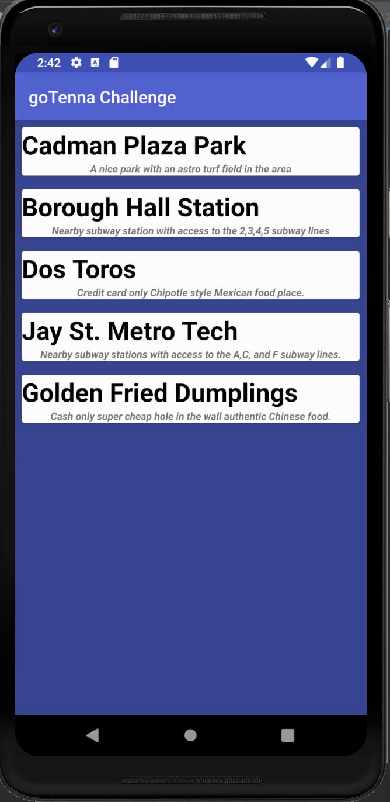
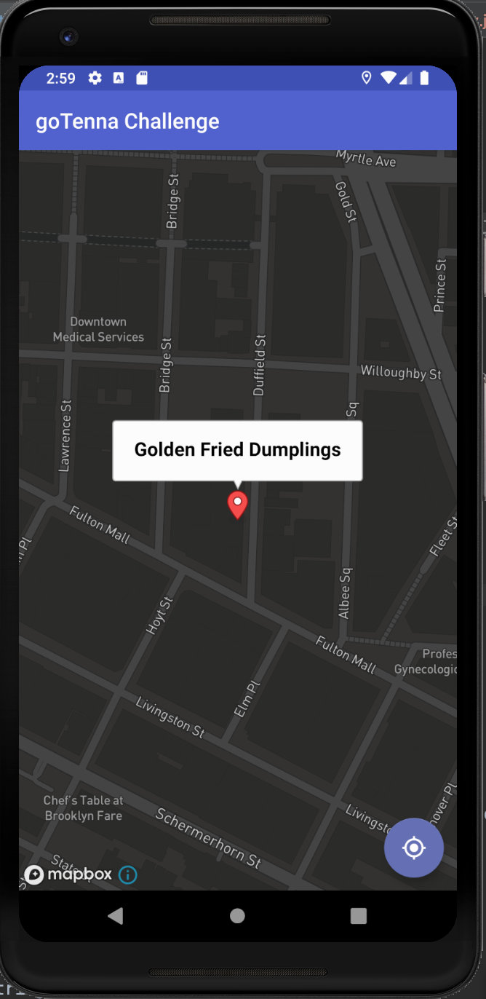
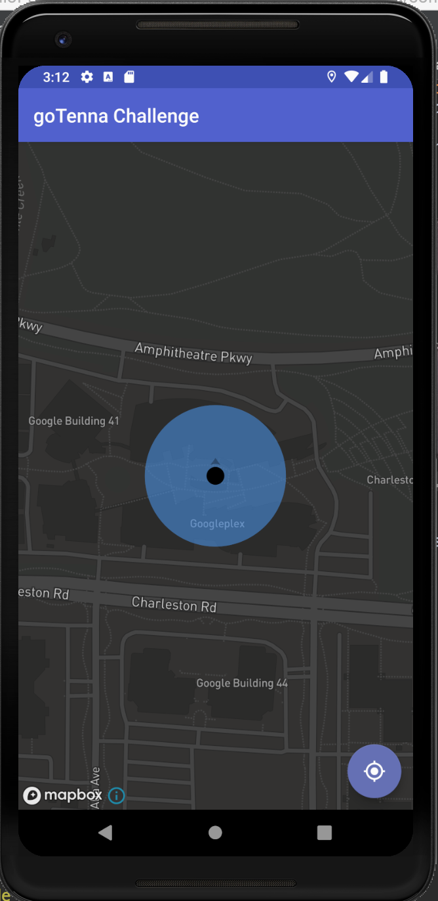

# goTenna-Coding-Challenge

## Libraries implemented
Room Database, Lifecycle, RxJava Room, RxAndroid, RxJava2, RetroFit2, MapBox, RecyclerView, CardView

##Trello Board Link
https://trello.com/b/dcktu3uw

## Time Spent
August 15, 2019 09:43 am - August 20, 2019 03:34pm
 
## App Screenshots

